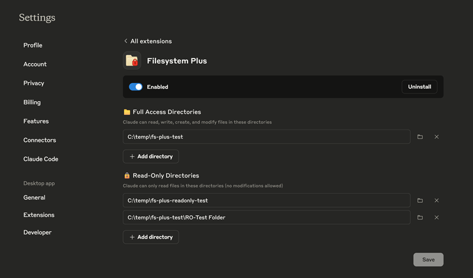

# 🛡️ Filesystem Plus – Enhanced Claude Desktop Extension with Read-Only Protection


[](https://github.com/smcneece/ClaudeDesktopFilesystemPlus/releases)
[](https://github.com/smcneece/ClaudeDesktopFilesystemPlus/commits/main)
[](LICENSE)
[](https://github.com/smcneece)

> [](https://github.com/sponsors/smcneece) <-- Why not sponsor me, even a few bucks shows you appreciate the work and gives encouragement. You can sponsor me monthly, or just a one time thing. Check out my [other projects](https://github.com/smcneece?tab=repositories) while you're here.

> ⭐ **Help Others Find This Extension!** If Filesystem Plus is working well for you, please star this repository to help other Claude Desktop users discover enhanced file system security!
>
> [](https://github.com/smcneece/ClaudeDesktopFilesystemPlus/stargazers) [](https://github.com/smcneece/ClaudeDesktopFilesystemPlus/network/members)

> 📬 **Stay Updated:** Click the "Watch" button (top-right of this repo) → "Releases only" to get email notifications when new versions are released!

Filesystem Plus was born from me wanting to improve the abysmal performance of file operations, as well as fix the lack of permission controls. 
This extension adds **granular permission control**, allowing you to give Claude Desktop read-only access to sensitive directories while maintaining full read-write access to working directories.

This is extremely important because I also added a delete file function, yup Claude Desktop can now delete files. I suggest never allowing it unrestricted, as just like other extensions tools are controlled by allow once, and allow always permissions. 

Sadly I was only able to make file copying faster, like a ton faster! I'm stil researching making other operations faster.

---

## 🔥 Key Features

### 🛡️ **Advanced Security & Safety**
- **Read-Only Directory Protection** - Configure directories that Claude can read but never modify
- **Safe File Deletion** - NEW! Delete files/directories with comprehensive safety checks
  - Blocks system directories (`C:\`, `/system32/`, `/boot/`, `/etc/`)  
  - Prevents read-only directory deletion
  - Multiple validation layers and confirmation prompts
- **Granular Permission Control** - Mix read-write and read-only directories in the same extension
- **Path Traversal Protection** - Prevents `../` escape attempts and symlink exploitation

### ⚡ **Performance & Compatibility** 
- **Blazing Fast File Copying** - HUGE performance improvement with direct OS operations
- **Windows Drive Root Support** - Fixed access to network drives, UNC paths, and mapped drives (Y:\, Z:\)
- **Cross-Platform Path Handling** - Seamless Windows/macOS/Linux compatibility
- **Enhanced Error Handling** - Clear, actionable error messages for all failure scenarios

### 🎯 **User Experience**
- **Enhanced Directory Listing** - See permission levels for each configured directory  
- **Individual Tool Permissions** - Each tool (including delete) requires separate Claude Desktop approval
- **Drop-in Replacement** - Uses the same familiar file operations as the original extension  
- **Zero Configuration Changes** - Existing automations continue to work unchanged

---

## 🛡️ Security Benefits

### **Before (Original Extension)**
```
- ALL directories have FULL read-write access
- No protection against accidental modifications  
- Claude can delete or overwrite any accessible file
- One permission level for all directories
```

### **After (Filesystem Plus)**
```  
- Read-only directories are protected from ALL write operations
- Clear visual indicators show permission levels
- Write operations blocked with helpful error messages
- Mix read-write and read-only directories as needed
```

---

## 🚀 Installation

### **Prerequisites**
- Claude Desktop (v0.10.0 or later)
- Windows, macOS, or Linux

### **Method 1: Manual Installation (Recommended)**
> **⚠️ DXT Status Update:** We're currently investigating issues with DXT packaging that may prevent some features from working correctly. Manual installation is the only method supported currently. 

1. Download the latest release: [**Download Filesystem Plus**](https://github.com/smcneece/ClaudeDesktopFilesystemPlus/releases/latest)
2. Extract the `filesystem-plus` folder
3. Open Claude Desktop → **Settings** → **Extensions** 
4. Click **Install Extension**
5. Select the extracted `filesystem-plus` folder
6. Confirm installation

### **Method 2: DXT Installation (Under Investigation)**
> **🔧 Known Issue:** DXT installation may not show complete extension details in Claude Desktop. We're working on a fix.

1. Download the latest `.dxt` file: [**Download Filesystem Plus**](https://github.com/smcneece/ClaudeDesktopFilesystemPlus/releases/latest)
2. Open Claude Desktop → **Settings** → **Extensions**
3. **Windows**: Drag and drop the `.dxt` file into the extensions area
   **Mac/Linux**: Go to **Advanced** → **Install Extension** → Select the `.dxt` file
4. Installation complete!

### **Step 3: Configure Permissions**
1. In the extension settings, configure directories:
   - **📁 Full Access Directories**: Claude can read, write, create, and modify files
   - **🔒 Read-Only Directories**: Claude can only read files (no modifications allowed)
2. Click **Save** to apply changes
3. Test with a small file operation to verify permissions


*Extension configuration page showing dual directory types with clear permission indicators*

---

## 🏗️ Attribution & License

Filesystem Plus is an enhanced version of the original Filesystem extension developed by **Anthropic**. We extend our gratitude to the Anthropic team for creating the foundational filesystem MCP server that makes this enhanced version possible.

**Original Work**: [Anthropic Claude Desktop Filesystem Extension](https://claude.ai)  
**License**: MIT License (both original and enhanced versions)  
**Our Enhancements**: Read-only protection, performance optimizations, granular permissions

This project builds upon Anthropic's excellent foundation while adding security features requested by the community. All code modifications and enhancements are also released under the MIT License.

---

## ⚙️ Configuration Examples

### **Safe Document Analysis**
```
📁 Full Access: ~/Documents/Claude-Workspace  
🔒 Read-Only: ~/Documents/Important-Files
🔒 Read-Only: ~/Documents/Financial-Records  
```

### **Code Development**  
```
📁 Full Access: ~/Projects/current-project
📁 Full Access: ~/Downloads/temp-files
🔒 Read-Only: ~/Projects/production-code
🔒 Read-Only: ~/.config
```

### **Content Creation**
```
📁 Full Access: ~/Content/drafts
📁 Full Access: ~/Content/images  
🔒 Read-Only: ~/Content/published
🔒 Read-Only: ~/Content/templates
```

---

## 🔧 Supported Operations

### **✅ Read Operations (Both Permission Types)**
- `read_file` - Read file contents
- `read_multiple_files` - Read multiple files at once
- `list_directory` - List directory contents  
- `directory_tree` - Get directory structure
- `search_files` - Search for files by pattern
- `get_file_info` - Get file metadata
- `list_allowed_directories` - Show configured directories with permissions

### **✅ Write Operations (Read-Write Only)**
- `write_file` - Create or overwrite files
- `edit_file` - Make line-based edits
- `create_directory` - Create new directories
- `move_file` - Move or rename files
- `delete_file` - **NEW!** Permanently delete files/directories with comprehensive safety checks
  - Recursive directory deletion with confirmation
  - System directory protection (blocks `/system32/`, `/etc/`, drive roots)
  - Requires individual tool permission approval in Claude Desktop
  - Blocked in read-only directories for additional safety

### **❌ Blocked Operations (Read-Only Directories)**
All write operations (including delete) in read-only directories return clear error messages instead of succeeding.

---

## 🧠 How It Works

Filesystem Plus uses a **permission proxy architecture**:

1. **Request Interception**: All file operations are intercepted before reaching the filesystem
2. **Permission Checking**: Write operations are checked against read-only directory list  
3. **Selective Blocking**: Read-only violations return permission denied errors
4. **Pass-Through**: Allowed operations are forwarded to the original filesystem server

This ensures **zero performance impact** for allowed operations while providing robust protection for sensitive directories.

---

## 🆚 Filesystem Plus vs Original Extension

| Feature | Original Filesystem | Filesystem Plus |
|---------|-------------------|-----------------|
| **Permission Model** | All-or-nothing | ✅ Granular control |
| **Read-Only Protection** | ❌ None | ✅ Full protection |
| **File Deletion** | ❌ Not supported | ✅ Safe deletion with system protection |
| **Windows Drive Root Access** | ❌ Limited | ✅ Full drive root + UNC path support |
| **Permission Visibility** | ❌ Hidden | ✅ Clear indicators |  
| **Safety Checks** | ❌ Basic | ✅ Multi-layer system directory protection |
| **Error Messages** | ❌ Generic | ✅ Detailed explanations |
| **Cross-Platform Paths** | ❌ Limited | ✅ Enhanced Windows/macOS/Linux support |
| **Backward Compatibility** | ✅ N/A | ✅ 100% compatible |
| **Performance** | ✅ Fast | ✅ Same speed + optimized file copying |

---

## 🚨 Important Security Notes

- **Read-only protection is enforced at the extension level** - Claude cannot bypass these restrictions
- **Permissions are configured per-session** - Changes require Claude Desktop restart
- **Path traversal attempts are blocked** - `../` attempts to escape directories are prevented  
- **All write operations are logged** - Failed attempts are recorded in Claude Desktop logs

---

## 🔍 Troubleshooting

### **Extension Not Loading**
1. Ensure Node.js support is enabled in Claude Desktop
2. Check Claude Desktop logs for error messages
3. Verify the `filesystem-plus` folder contains all required files

### **Permissions Not Working**  
1. Restart Claude Desktop after configuration changes
2. Test with a simple write operation in a read-only directory
3. Check that directory paths are absolute and correctly typed

### **Performance Issues**
1. Filesystem Plus has the same performance as the original extension
2. Large file operations may appear slower due to permission checks
3. Use `read_multiple_files` for better batch performance

---
## 🤝 Contributing

Contributions are welcome! Please feel free to submit issues, feature requests, or pull requests.

### **Development Setup**
1. Fork the repository
2. Clone your fork locally
3. Create a feature branch
4. Make your changes  
5. Test with Claude Desktop
6. Submit a pull request

---

## 📄 License

This project is licensed under the MIT License - see the [LICENSE](LICENSE) file for details.

---

## 🏷️ GitHub Repo Tags
```
claude-desktop, filesystem, security, permissions, read-only, file-management, desktop-extension, mcp-protocol
```

---

**Enjoying enhanced filesystem security with Filesystem Plus? Consider starring this repository to help other Claude Desktop users discover granular file system control!**

🛡️ **Filesystem Plus – Enhanced Claude Desktop Extension**  
Because file system security shouldn't be all-or-nothing.
